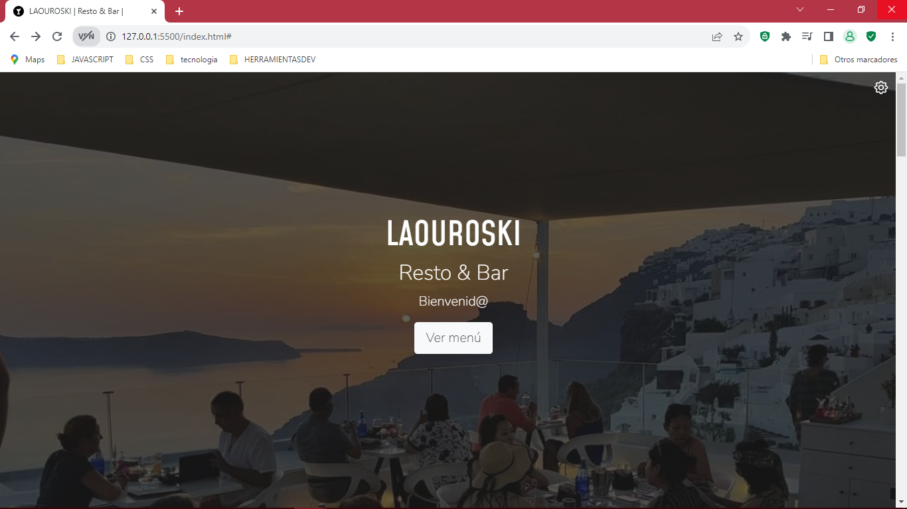
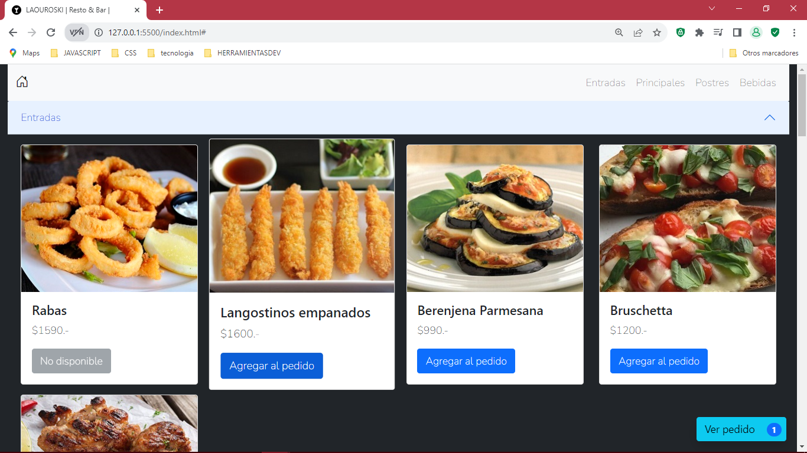
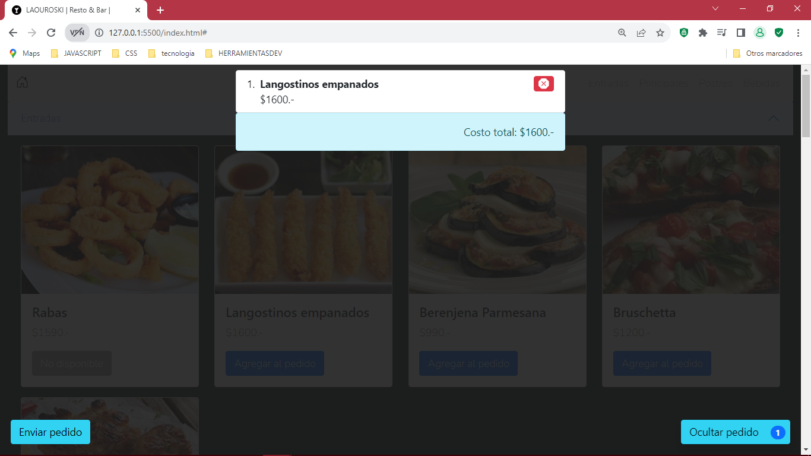
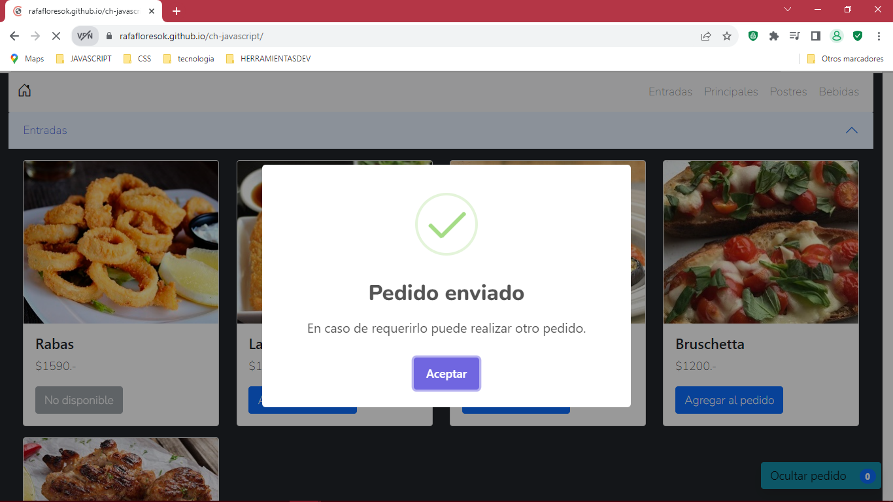

# <h1 style="justify-content: center"> Entrega final restaurante 🍹🥗 </h1>

 

<h2>Entradas</h2>

 

Puedes agregar tu lista de pedidos.

<h2>Lista de compra</h2>

 

<h2>Envio de pedido</h2>
 

Al realizar el envio tendras un promedio de 20minutos para estar listo tu pedido. 
